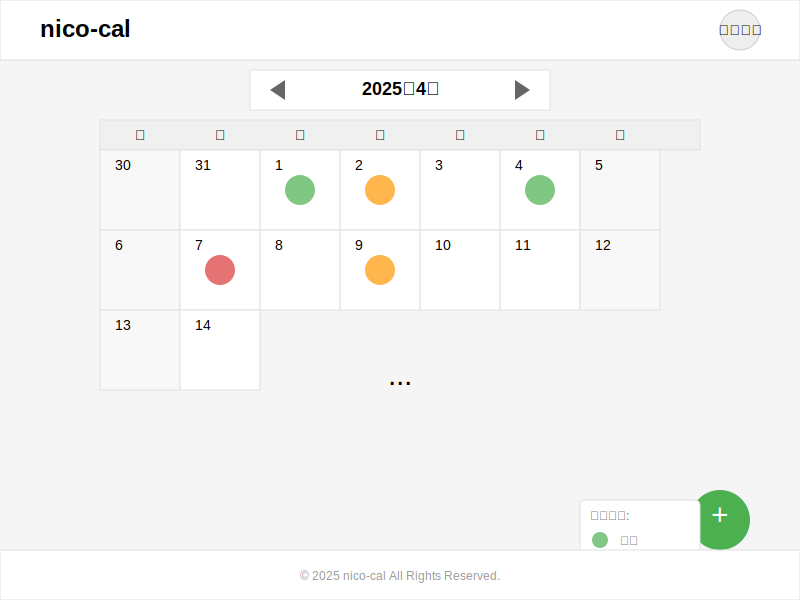

# nico-cal ワイヤーフレームドキュメント

このドキュメントでは、nico-calアプリケーションの主要画面のワイヤーフレームと画面設計について説明します。

## 1. 画面一覧

nico-calは以下の主要画面で構成されています：

1. ログイン画面
2. 新規登録画面
3. カレンダー画面（ホーム）
4. 日記作成画面
5. 日記詳細画面
6. 日記編集画面（日記作成画面と同様のレイアウト）
7. アカウント設定画面（省略）

## 2. 画面詳細

### 2.1 ログイン画面

ユーザーがシステムにアクセスするための認証画面です。

**主要コンポーネント：**
- ユーザーID入力フィールド
- パスワード入力フィールド
- ログインボタン
- 新規登録へのリンク

**遷移先：**
- ログイン成功時 → カレンダー画面
- 新規登録リンククリック時 → 新規登録画面


### 2.2 新規登録画面

新しいユーザーがアカウントを作成するための画面です。

**主要コンポーネント：**
- ユーザーID入力フィールド（バリデーション付き）
- パスワード入力フィールド（バリデーション付き）
- パスワード確認入力フィールド
- 登録ボタン
- ログインへのリンク

**遷移先：**
- 登録成功時 → カレンダー画面
- ログインリンククリック時 → ログイン画面


### 2.3 カレンダー画面（ホーム）

月別カレンダーを表示し、各日の感情状態を一覧できる画面です。

**主要コンポーネント：**
- 月選択（前月・翌月ボタン付き）
- 曜日ヘッダー
- 日付グリッド
- 各日の感情状態アイコン
- 新規日記作成ボタン
- ユーザーメニュー
- 感情状態の凡例

**遷移先：**
- 日付クリック時 → 該当日の日記詳細画面（または新規作成画面）
- 新規日記作成ボタンクリック時 → 日記作成画面（当日）
- ユーザーメニュークリック時 → アカウント設定画面



### 2.4 日記作成画面

新しい日記エントリーを作成するための画面です。

**主要コンポーネント：**
- 日付選択
- 感情状態選択（良い/普通/悪い）
- コメント入力エリア
- 保存ボタン
- キャンセルボタン
- 戻るボタン

**遷移先：**
- 保存ボタンクリック時 → カレンダー画面
- キャンセルボタンまたは戻るボタンクリック時 → カレンダー画面


### 2.5 日記詳細画面

特定の日の日記内容を表示する画面です。

**主要コンポーネント：**
- 日付表示
- 感情状態表示
- 日記内容表示
- 作成日時・更新日時
- 編集ボタン
- 削除ボタン
- 戻るボタン

**遷移先：**
- 編集ボタンクリック時 → 日記編集画面
- 削除実行時 → カレンダー画面
- 戻るボタンクリック時 → カレンダー画面


### 2.6 日記編集画面

既存の日記エントリーを編集するための画面です。レイアウトは日記作成画面と同様で、既存の内容が予め入力されています。

**主要コンポーネント：**
- 日付表示（編集不可）
- 感情状態選択（良い/普通/悪い）（既存の選択が反映）
- コメント入力エリア（既存のコメントが表示）
- 更新ボタン
- キャンセルボタン
- 戻るボタン

**遷移先：**
- 更新ボタンクリック時 → 日記詳細画面
- キャンセルボタンまたは戻るボタンクリック時 → 日記詳細画面

## 3. デザインガイドライン

### 3.1 カラーパレット

- プライマリカラー: #4caf50（緑）
- セカンダリカラー: #2196f3（青）
- アクセントカラー: #e57373（赤）
- 背景色: #f5f5f5（薄いグレー）
- テキスト色: #333333（濃いグレー）

### 3.2 感情状態の色分け

- 良い: #81c784（緑）
- 普通: #ffb74d（オレンジ）
- 悪い: #e57373（赤）

### 3.3 フォント

- ヘッダー: Arial, 24px, Bold
- メインタイトル: Arial, 20px, Bold
- 本文: Arial, 14px, Regular
- 小さいテキスト: Arial, 12px, Regular

### 3.4 ボタンスタイル

- プライマリボタン: 背景色 #4caf50, テキスト色 #ffffff, 角丸 3px
- セカンダリボタン: 背景色 #2196f3, テキスト色 #ffffff, 角丸 3px
- デンジャーボタン: 枠線色 #e57373, テキスト色 #e57373, 背景色 #ffffff, 角丸 3px
- リンクボタン: テキスト色 #2196f3, 下線付き

## 4. レスポンシブデザイン対応

- モバイル表示（幅 < 768px）: 
  - 1カラムレイアウト
  - フォントサイズ縮小
  - タッチフレンドリーなボタンサイズ

- タブレット表示（768px <= 幅 < 1024px）:
  - 2カラムレイアウト
  - カレンダーはスワイプで月切替

- デスクトップ表示（幅 >= 1024px）:
  - 上記ワイヤーフレームの通り

## 5. アクセシビリティ考慮事項

- 十分なコントラスト比を確保
- キーボードナビゲーション対応
- スクリーンリーダーの適切なラベル付け
- 感情状態は色だけでなくアイコン/テキストも併用

## 6. 画面遷移図

```
+----------------+     +-------------------+
|   ログイン画面   +---->+   新規登録画面     |
+--------+-------+     +---------+---------+
         |                       |
         v                       v
+--------+------------------------+------+
|              カレンダー画面            |
+---+----------------+----------------+-+
    |                |                |
    v                v                v
+---+----+    +------+-----+    +-----+------+
|日記作成 |    |日記詳細画面 |    |アカウント設定|
+---+----+    +------+-----+    +------------+
    |                |
    v                v
    |          +-----+------+
    |          |日記編集画面 |
    |          +-----+------+
    |                |
    +----------------+
```

## 7. 実装上の注意点

- フォームのバリデーションは、フロントエンドとバックエンドの両方で実施
- 日記テキストは2000文字まで入力可能
- 日付選択はブラウザネイティブの日付ピッカーを使用
- ローディング状態と各種エラー状態の表示も考慮する
- ログイン状態は定期的に確認し、セッション切れの場合は再ログインを促す
